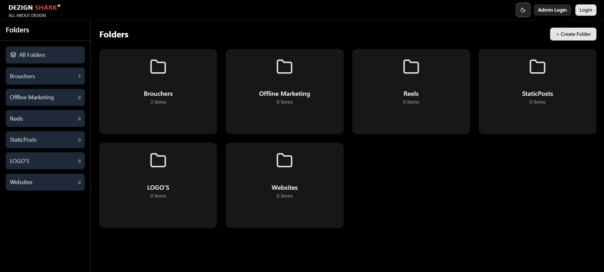

# 📂 File Manager Application (MERN + TypeScript + React)




A full-stack file manager where users can:

* Authenticate (sign up / login / logout)

* Upload files to Cloudinary

* Organize files into folders

* Admins can view & manage users

* Dark/Light mode support with modern UI

## 🛠️ Tech Stack

* Node.js + Express.js – server framework
* MongoDB + Mongoose – database
* TypeScript – type safety
* JWT (jsonwebtoken) – authentication
* bcryptjs – password hashing
* Cloudinary SDK – file storage
* dotenv – environment variables
* cors, morgan – middleware & logging

## Frontend

* React (with Vite) – UI framework
* TypeScript – type safety
* Axios – API calls
* Tailwind CSS – styling
* ShadCN UI – accessible UI components
* Lucide Icons – icons
* Sonner – toast notifications


## Installation & Setup

Clone Repository

```bash
    git clone <your_repo_url>
    cd file-manager-app
```
## Backend setup

```bash
    cd backend
    npm install
```
## Environment Variables

To run this project, you will need to add the following environment variables to your .env file

`PORT=5000`

`MONGO_URI=your_mongo_connection_string`

`JWT_SECRET=your_secret_key`

`CLOUDINARY_NAME=your_cloudinary_name`

`CLOUDINARY_API_KEY=your_key`

`CLOUDINARY_API_SECRET=your_secret`


### Run backend

```bash
    npm run dev
```
## Frontend setup

```bash
    cd frontend
    npm install
```

###  Configure API base URL in src/config/api.ts:

```bash
export const api = axios.create({
  baseURL: "http://localhost:5000/api",
  withCredentials: true,
});

```

### Run frontend

```bash
    npm run dev
```


## API Endpoints

* POST /api/user/register → Register new user

* POST /api/user/login → Login user

* POST /api/user/logout → Logout user

* GET /api/user/protected → Protected route (JWT required)

### Admin

* GET /api/admin/getAllUsers → Get all users (Admin only, pass token)

* DELETE /api/admin/removeUser/:id → Delete user by ID (Admin only)

## Files

* POST /api/files/upload → Upload file (form-data: file, folder)

* GET /api/files/folders → Get all folders

* GET /api/files/:folderName → Get files inside folder


## 🎨 Frontend Features

* 🔐 Authentication (login, register, logout)

* 📂 Folder & File Management

* ☁️ Uploads to Cloudinary

* 🛠️ Admin Panel (view & delete users)

* 🌓 Dark/Light Mode toggle

* ✨ Smooth Animations with GSAP

* ✅ Modern UI with ShadCN + Tailwind


## ✅ Summary
* Backend: Node.js, Express, MongoDB, JWT, Cloudinary

* Frontend: React + Vite, TypeScript, Tailwind, ShadCN UI, Axios, GSAP

* Features: Auth, File upload, Folder management, Admin panel, Dark/Light mode

This project demonstrates full-stack skills: secure backend APIs + modern animated frontend.